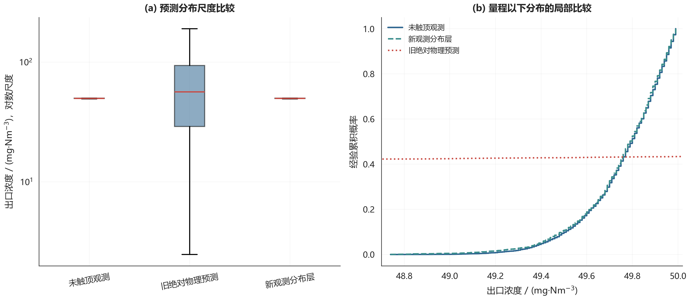
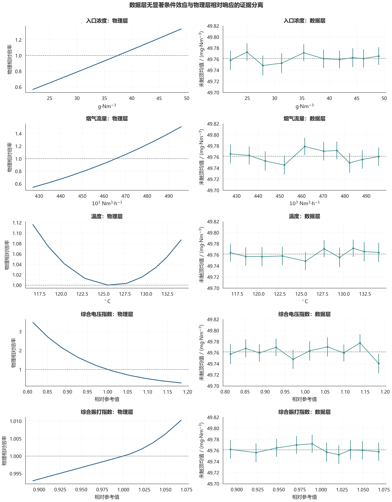

# 非触顶分布校准—物理相对响应双层模型：四问影响报告

> 本报告为独立重算结果，不修改论文。观测层只描述4,539条未触顶记录；物理层只提供相对响应，不再解释为历史绝对浓度预测。

## 一、模型与分布验证

观测层均值为 49.7614 mg/Nm³，标准差为 0.1801 mg/Nm³。逐日留一验证的平均 KS 距离为 0.0363，平均 Wasserstein 距离为 0.0116 mg/Nm³，日均值平均绝对误差为 0.0106 mg/Nm³，95% 区间平均覆盖率为 97.50%。八个工况参考点的物理倍率均严格等于 1，最大数值误差为 0。

## 二、问题一：因素关系的证据分离

| factor | physical_response | uncensored_spearman_rho | uncensored_bin_pvalue | data_supported_effect |
| --- | --- | --- | --- | --- |
| 入口浓度 | 物理层单调上升 | -0.0034 | 0.6307 | 否 |
| 烟气流量 | 物理层单调上升 | -0.0044 | 0.1107 | 否 |
| 温度 | 物理层参考中心附近最低 | 0.0206 | 0.6508 | 否 |
| 综合电压指数 | 物理层单调下降 | -0.0128 | 0.0807 | 否 |
| 综合振打指数 | 物理层单调上升 | -0.0064 | 0.8580 | 否 |

数据层未识别出显著因素效应；物理层仅报告相对响应方向及情景倍率。

## 三、问题二：10 mg/Nm³校准策略

| label | U1_kV | U2_kV | U3_kV | U4_kV | T1_s | T2_s | T3_s | T4_s | power_kW | c_p95_mgNm3 | compliance_probability | dust_load_index | feasible |
| --- | --- | --- | --- | --- | --- | --- | --- | --- | --- | --- | --- | --- | --- |
| R1 | 62.7895 | 64.1019 | 52.0008 | 57.1199 | 290.00 | 289.00 | 506.00 | 510.00 | 1849.75 | 9.5438 | 0.9679 | 0.9029 | 是 |
| R2 | 68.7423 | 71.1416 | 58.9648 | 57.8445 | 290.00 | 289.00 | 506.00 | 510.00 | 2069.77 | 9.6119 | 0.9655 | 1.0982 | 是 |
| R3 | 62.0388 | 64.7349 | 52.2752 | 57.7251 | 290.00 | 289.00 | 506.00 | 510.00 | 1857.08 | 9.5080 | 0.9672 | 1.2571 | 是 |
| R4 | 70.9000 | 67.6657 | 59.1138 | 51.3778 | 283.85 | 286.09 | 506.00 | 505.39 | 2002.38 | 8.8425 | 0.9774 | 1.4500 | 是 |
| R5 | 70.8956 | 71.3981 | 59.1975 | 58.1894 | 160.89 | 154.75 | 364.98 | 363.30 | 2498.55 | 12.8156 | 0.8413 | 0.9913 | 否 |
| R6 | 63.3277 | 61.5944 | 57.1073 | 57.9896 | 255.24 | 257.47 | 446.66 | 443.05 | 1962.44 | 9.9081 | 0.9535 | 1.4500 | 是 |
| R7 | 68.4043 | 67.4429 | 55.6430 | 56.1335 | 254.77 | 254.51 | 449.17 | 445.35 | 2053.11 | 9.6158 | 0.9706 | 1.4500 | 是 |
| R8 | 69.6207 | 68.9280 | 50.8203 | 55.6370 | 250.17 | 249.99 | 439.65 | 434.13 | 2050.00 | 9.7207 | 0.9647 | 1.4500 | 是 |

在历史操作边界内，7/8 个工况通过独立 10,000 情景检验。R5 未满足 95% 机会约束，故不将其表中数值解释为可执行最优策略；采用 110% 电压上界情景后，八个工况均获得可行解。

## 四、问题三：低、高负荷动作优先级

低负荷工况为R2，首要类别为电压优先，首要变量为U3_kV；高负荷工况为R8，首要类别为周期优先，首要变量为T3_s。周期优先只表示尘负荷约束恢复顺序，直接减排收益仍单独报告。

## 五、问题四：10降至5的电耗变化

| label | power_10_110pct_kW | wide_10_feasible | raw_5_feasible | power_5_110pct_kW | wide_5_feasible | increase_pct |
| --- | --- | --- | --- | --- | --- | --- |
| R1 | 1848.03 | 是 | 是 | 1967.98 | 是 | 6.4904 |
| R2 | 2072.01 | 是 | 否 | 2182.00 | 是 | 5.3084 |
| R3 | 1855.09 | 是 | 是 | 1962.03 | 是 | 5.7642 |
| R4 | 2000.91 | 是 | 是 | 2105.98 | 是 | 5.2510 |
| R5 | 2229.65 | 是 | 否 | 2338.38 | 是 | 4.8765 |
| R6 | 1968.06 | 是 | 是 | 2068.49 | 是 | 5.1029 |
| R7 | 2052.74 | 是 | 是 | 2165.39 | 是 | 5.4879 |
| R8 | 2049.12 | 是 | 是 | 2161.27 | 是 | 5.4731 |

在相同的 110% 电压上界下，按工况占比加权的 10 mg/Nm³ 功率为 2021.95 kW，5 mg/Nm³ 功率为 2129.51 kW，增幅为 5.32%。在历史边界内，5 mg/Nm³ 限值存在 2 个不可行工况；在 110% 边界下，10 mg/Nm³ 与 5 mg/Nm³ 两组策略均在八个工况中通过独立验证。

## 六、敏感性与重采样稳定性

经验分布进行 12 次独立重采样后，R8 的 10 mg/Nm³ 策略排放 95% 分位处于 9.5288–9.7169 mg/Nm³，达标概率处于 96.49%–97.30%；5 mg/Nm³ 策略对应区间为 4.7732–4.8426 mg/Nm³ 和 96.39%–97.18%，说明观测基线抽样误差对结论影响较小。

在温度、积灰、振打系数和分场权重的 ±30% 扰动下，10 mg/Nm³ 策略的排放 95% 分位为 9.4023–9.7293 mg/Nm³，5 mg/Nm³ 策略为 4.5599–5.0387 mg/Nm³。分场权重的不利扰动可使 5 mg/Nm³ 策略轻微越过限值，因此工程实施时应保留额外控制裕量。迁移尺度参数 $d_{\mathrm{ref}}$ 的敏感性最强：其 ±30% 扰动分别使上述区间扩展至 5.7662–15.9457 mg/Nm³ 和 2.3492–9.8417 mg/Nm³。由此可知，低量程出口测量与迁移尺度现场标定是将情景方案转化为控制定值的必要条件。

## 七、新旧结果比较与适用边界

| label | old_power_10_kW | calibrated_power_10_kW | calibrated_feasible_10 | calibrated_power_change_pct | old_c_p95_10_mgNm3 | calibrated_c_p95_10_mgNm3 |
| --- | --- | --- | --- | --- | --- | --- |
| R1 | 2036.01 | 1849.75 | 是 | -9.1483 | 9.1241 | 9.5438 |
| R2 | 1961.40 | 2069.77 | 是 | 5.5251 | 9.4272 | 9.6119 |
| R3 | 2000.02 | 1857.08 | 是 | -7.1468 | 9.2537 | 9.5080 |
| R4 | 2021.92 | 2002.38 | 是 | -0.9664 | 8.7927 | 8.8425 |
| R5 | 2084.40 | 2498.55 | 否 | — | 9.0438 | 12.8156 |
| R6 | 2026.76 | 1962.44 | 是 | -3.1732 | 8.9936 | 9.9081 |
| R7 | 2118.00 | 2053.11 | 是 | -3.0635 | 9.3796 | 9.6158 |
| R8 | 2152.89 | 2050.00 | 是 | -4.7791 | 9.2162 | 9.7207 |

新模型改善的是历史未触顶分布的一致性，而不是逐分钟预测R²。10/5 mg/Nm³仍属于物理相对响应主导的限值外推；现场应用前仍需低量程出口仪表和分场电流数据标定。
