# A题：水泥烧成系统电除尘器协同优化控制——逐问解答

> 本文档是第一阶段数值解答。所有结果由 `scripts/run_all.py` 从原始 CSV 一键生成。出口浓度没有进行比例换算；50 mg/Nm³被按右删失处理。由于 10/5 mg/Nm³均在观测范围外，排放数值属于“删失锚定 + 物理先验”的外推结果，而不是附件数据直接验证的经验回归。

## 1. 数据诊断与关键判断

数据含 10,080 个连续分钟、50 个孤立出口缺失点；5491 个读数贴在 50 mg/Nm³上限，占 54.47%。右删失正态极大似然得到潜在均值 50.036、标准差 0.313 mg/Nm³。

把温度、入口浓度、流量、四场电压与四场振打周期同时用于普通线性回归，原始出口浓度的 $R^2$ 仅为 0.000815；对“是否触及50上限”建线性概率模型，$R^2$ 也只有 0.001162。这说明闭环运行和仪表截断已抹去可用于辨识控制效应的输出变化，不能用高阶机器学习强行声称得到因果关系。

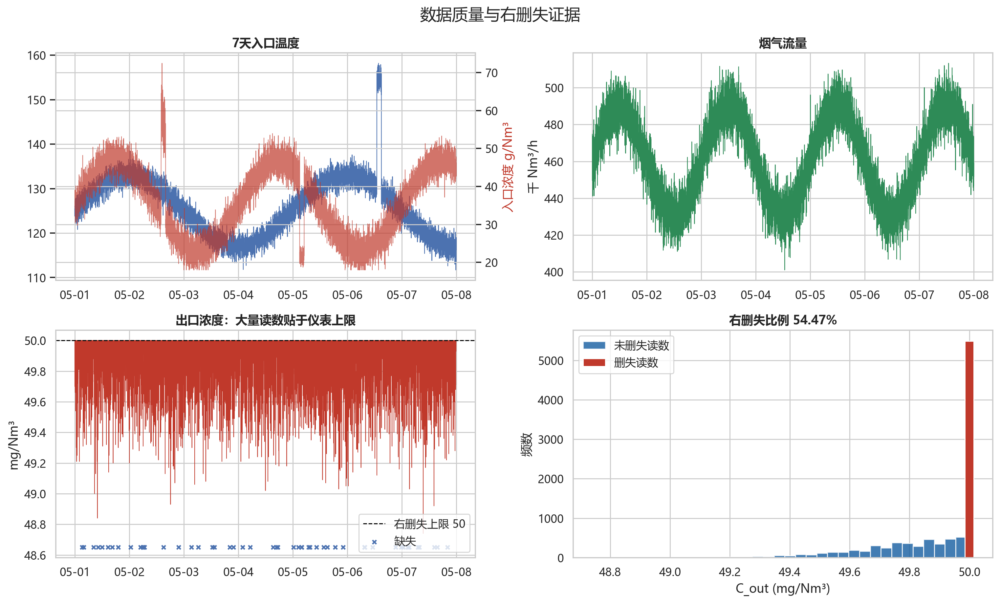

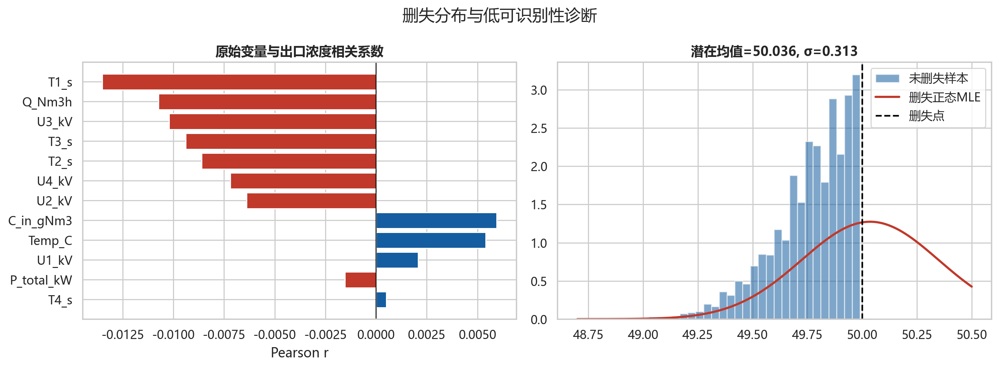

## 2. 问题1：因素关系与振打峰值

### 2.1 删失物理信息模型

采用 Deutsch–Anderson 指数穿透结构：

$$
C_{\mathrm{base},t}=1000C_{\mathrm{in},t}\exp(-D_t),
$$

$$
D_t=D_0\frac{Q_0}{Q_t}g_T(T_t)
\left[\sum_{i=1}^4w_i\left(\frac{U_i}{U_{i,0}}\right)^2\right]
g_L(\mathbf{T}_t,C_{\mathrm{in},t}Q_t).
$$

其中 $g_T$ 是以 125°C 为中心的温度修正，$g_L$ 是长振打周期引起的积灰/反电晕折减。基准去除指数由右删失运行点和质量守恒锚定为 $D_0=6.6846$。分场权重、温度和再飞扬系数由权威文献给出先验，并在计算中传播不确定性。

振打采用隐状态：极板尘负荷随捕集量累积，周期到达后大部分落入灰斗、小部分形成再飞扬脉冲。对未知振打相位积分后，95%排放分位数同时包含积灰效率损失和瞬时峰值风险。因此周期过长会积灰并放大单次峰值，过短则提高振打频率和机械能耗，存在内部折中点。

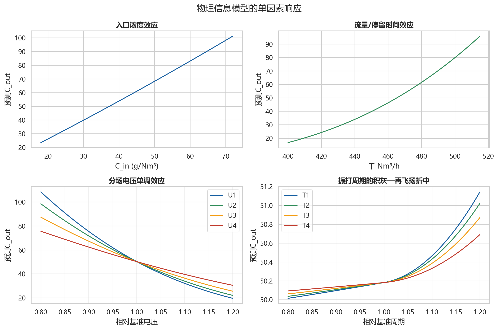

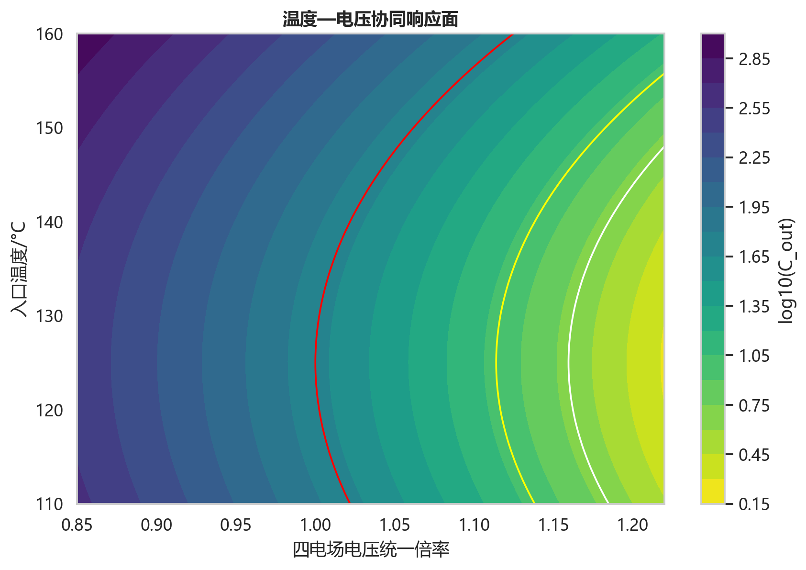

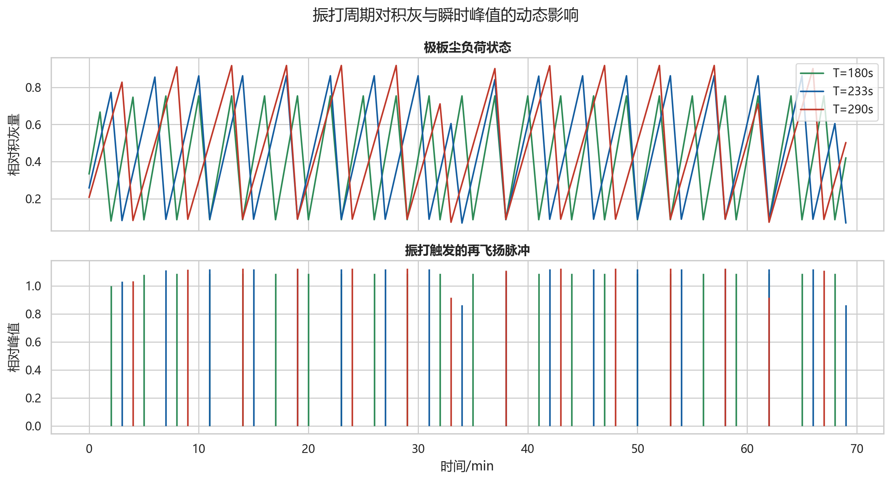

### 2.2 关系结论

- 入口浓度近似按比例抬升出口浓度；流量增加缩短停留时间，使穿透率上升。
- 电压通过迁移速度和去除指数发挥单调减排作用，边际减排收益随电压增大而递减。
- 125°C附近模型效率最佳；偏离该温区时，电气特性和粉尘比电阻的不确定性使所需控制强度增加。
- 振打周期不能只按“越长越省电”处理：长周期降低振打频率，却增加极板尘负荷、效率衰减和单次再飞扬峰值。

证据边界如下：

| quantity | evidence | diagnostic | status |
| --- | --- | --- | --- |
| 右删失位置与噪声 | 数据 | n=10030, censor=54.474% | 可识别 |
| 工况/操作量对出口浓度的净效应 | 数据 | OLS R2=0.000815 | 不可识别 |
| 删失事件的条件依赖 | 数据 | linear R2=0.001162 | 不可识别 |
| 基准去除指数 | 删失锚定+质量守恒 | D_ref=6.6846 | 弱识别 |
| 分场权重/温度/积灰/再飞扬系数 | 物理先验 | 统一传播30%相对不确定性 | 先验主导 |

## 3. 问题2：典型工况与最低电耗

### 3.1 工况划分

对温度、$\log C_{in}$、$\log Q$ 做15分钟中位数平滑和稳健标准化，再以时间正则化高斯混合模型划分。BIC在满足占比和持续时间约束的候选中选择 $K=8$。

| label | n | share | Temp_C_mean | C_in_gNm3_mean | Q_Nm3h_mean | mass_load_mean | median_dwell_min |
| --- | --- | --- | --- | --- | --- | --- | --- |
| R1 | 120 | 0.012 | 154.8 | 25.950 | 432,089 | 11,213,752 | 120.0 |
| R2 | 1704 | 0.169 | 120.9 | 25.843 | 477,095 | 12,320,839 | 852.0 |
| R3 | 1578 | 0.157 | 132.0 | 27.449 | 463,840 | 12,819,025 | 1578.0 |
| R4 | 1615 | 0.160 | 125.7 | 33.401 | 455,249 | 15,302,582 | 209.0 |
| R5 | 1274 | 0.126 | 132.2 | 42.181 | 450,973 | 19,097,403 | 1274.0 |
| R6 | 1716 | 0.170 | 121.1 | 44.522 | 442,537 | 19,679,909 | 120.0 |
| R7 | 1203 | 0.119 | 129.1 | 42.384 | 482,944 | 20,482,681 | 255.0 |
| R8 | 870 | 0.086 | 118.1 | 46.090 | 480,949 | 22,166,091 | 870.0 |

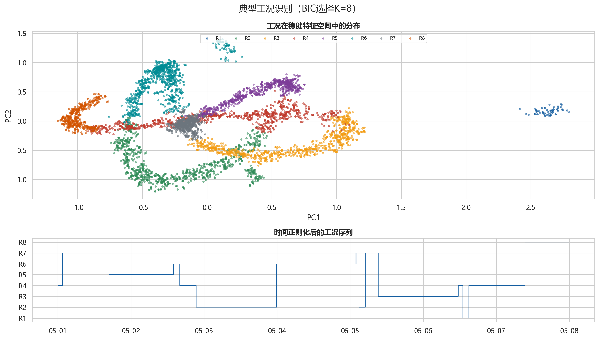

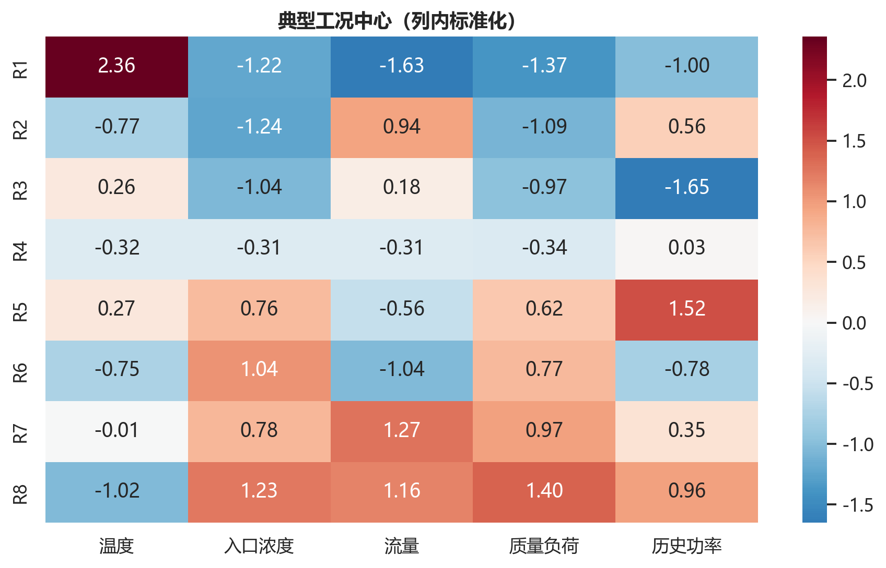

### 3.2 能耗模型

拟合结果为

$$
P=\beta_0+\sum_{i=1}^4\beta_iU_i^2+\sum_{i=1}^4\gamma_i/T_i+\varepsilon.
$$

全样本 $R^2=0.9979$；更严格的逐日留一验证平均 $R^2=0.9866$、RMSE=5.96 kW（约占平均功率的0.34%）。逐日 $R^2$ 未机械达到0.99，但绝对误差很小；本文保留这一真实验证结果，不通过随机分钟切分虚增精度。完整系数见 `power_coefficients.csv`。

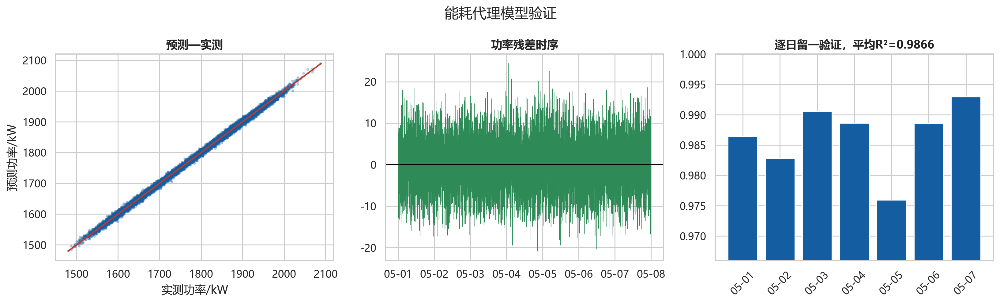

### 3.3 10 mg/Nm³最优控制表

优化在历史电压/周期边界内进行；内部按97.5%设计分位留出蒙特卡洛裕量，最后用独立10,000次模拟核查95%分位。

| label | U1_kV | U2_kV | U3_kV | U4_kV | T1_s | T2_s | T3_s | T4_s | power_kW | c_p95_mgNm3 | compliance_probability | dust_load_index | feasible |
| --- | --- | --- | --- | --- | --- | --- | --- | --- | --- | --- | --- | --- | --- |
| R1 | 69.340 | 70.242 | 59.200 | 55.937 | 290.0 | 289.0 | 506.0 | 510.0 | 2049.8 | 9.182 | 0.970 | 0.903 | 是 |
| R2 | 70.900 | 68.147 | 59.200 | 44.743 | 290.0 | 289.0 | 506.0 | 510.0 | 1947.6 | 9.052 | 0.975 | 1.098 | 是 |
| R3 | 70.900 | 69.322 | 59.200 | 48.315 | 290.0 | 289.0 | 506.0 | 510.0 | 1989.7 | 9.056 | 0.973 | 1.257 | 是 |
| R4 | 70.900 | 70.155 | 59.200 | 47.811 | 280.8 | 289.0 | 503.8 | 510.0 | 2002.1 | 8.840 | 0.971 | 1.450 | 是 |
| R5 | 70.900 | 70.864 | 58.783 | 48.414 | 253.1 | 263.3 | 439.8 | 478.0 | 2073.3 | 9.093 | 0.974 | 1.450 | 是 |
| R6 | 70.070 | 69.473 | 58.264 | 41.747 | 251.0 | 261.4 | 426.2 | 472.6 | 1998.8 | 9.796 | 0.956 | 1.450 | 是 |
| R7 | 70.900 | 67.700 | 59.200 | 55.296 | 247.6 | 261.5 | 429.7 | 473.9 | 2110.9 | 9.400 | 0.969 | 1.450 | 是 |
| R8 | 70.900 | 70.447 | 59.200 | 53.314 | 245.4 | 256.3 | 414.4 | 463.8 | 2138.2 | 9.209 | 0.977 | 1.450 | 是 |

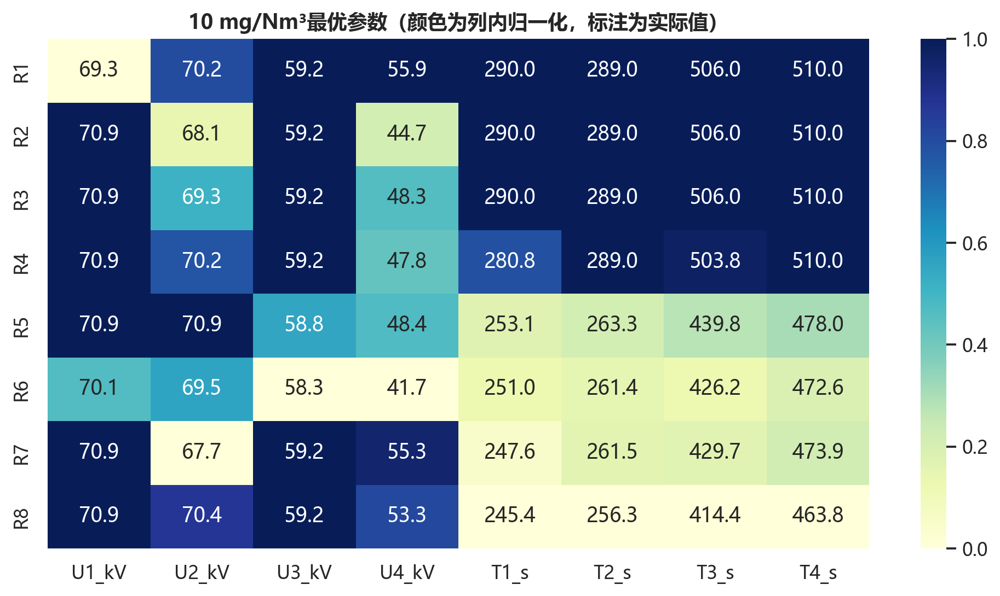

## 4. 问题3：两类工况与优先级

选取样本充分的低负荷工况 R2 与最高质量负荷工况 R8。操作参数为：

| 工况 | 标签 | U1_kV | 历史U1_kV | U2_kV | 历史U2_kV | U3_kV | 历史U3_kV | U4_kV | 历史U4_kV | T1_s | 历史T1_s | T2_s | 历史T2_s | T3_s | 历史T3_s | T4_s | 历史T4_s | power_kW | c_p95_mgNm3 | compliance_probability |
| --- | --- | --- | --- | --- | --- | --- | --- | --- | --- | --- | --- | --- | --- | --- | --- | --- | --- | --- | --- | --- |
| 低负荷 | R2 | 70.900 | 60.496 | 68.147 | 60.522 | 59.200 | 51.338 | 44.743 | 51.323 | 290.0 | 247.7 | 289.0 | 247.6 | 506.0 | 443.9 | 510.0 | 443.5 | 1947.6 | 9.052 | 0.975 |
| 高负荷 | R8 | 70.900 | 62.055 | 70.447 | 62.125 | 59.200 | 44.572 | 53.314 | 44.633 | 245.4 | 195.9 | 256.3 | 195.4 | 414.4 | 440.6 | 463.8 | 440.4 | 2138.2 | 9.209 | 0.977 |

单位增量电耗的减排收益排序：

**低负荷 R2**

| parameter | direction | delta_power_kW | p95_reduction_mgNm3 | reduction_per_added_kW |
| --- | --- | --- | --- | --- |
| U3_kV | 上限处反向差分 | 5.888 | 0.392 | 0.067 |
| U1_kV | 上限处反向差分 | 8.497 | 0.527 | 0.062 |
| U4_kV | 提高1% | 3.429 | 0.179 | 0.052 |
| U2_kV | 提高1% | 7.959 | 0.387 | 0.049 |
| T1_s | 缩短1% | 1.872 | 0.024 | 0.013 |
| T2_s | 缩短1% | 1.882 | 0.019 | 0.010 |
| T3_s | 缩短1% | 1.092 | 0.009 | 0.009 |
| T4_s | 缩短1% | 1.057 | 0.008 | 0.008 |

**高负荷 R8**

| parameter | direction | delta_power_kW | p95_reduction_mgNm3 | reduction_per_added_kW |
| --- | --- | --- | --- | --- |
| U3_kV | 上限处反向差分 | 5.888 | 0.369 | 0.063 |
| U1_kV | 上限处反向差分 | 8.497 | 0.533 | 0.063 |
| U4_kV | 提高1% | 4.869 | 0.272 | 0.056 |
| U2_kV | 提高1% | 8.505 | 0.433 | 0.051 |
| T2_s | 缩短1% | 2.122 | 0.012 | 0.006 |
| T1_s | 缩短1% | 2.212 | 0.010 | 0.005 |
| T4_s | 缩短1% | 1.162 | 0.005 | 0.004 |
| T3_s | 缩短1% | 1.334 | 0.001 | 0.001 |

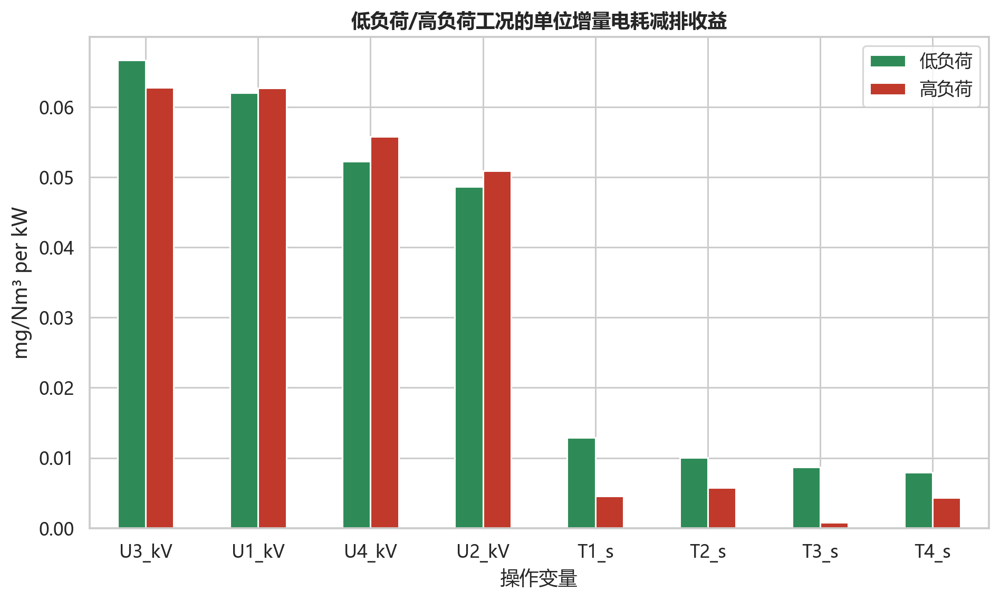

控制规律是：基线穿透占主导且积灰指数较低时，先提高减排收益/千瓦最大的电场电压；高负荷下若积灰约束活跃，则先缩短相应振打周期，再提高电压。最终场用于严格限值下的精细捕集，振打应错峰，避免多个电场脉冲叠加。

## 5. 问题4：10降至5的电耗代价

在完全相同的历史安全边界内，5 mg/Nm³有 3 个工况无法通过独立95%机会约束复核，因此不能为全工况给出虚假的“边界内最优百分比”。为完成政策情景测算，另做明确标注的条件仿真：仅把各场历史最大电压上界放宽至 1.030 倍，振打周期边界保持不变。

| regime | label | share | power_10_kW | raw_5_feasible | power_5_conditional_kW | conditional_5_feasible | increase_pct | voltage_upper_factor |
| --- | --- | --- | --- | --- | --- | --- | --- | --- |
| 0 | R1 | 0.012 | 2049.8 | 否 | 2166.8 | 是 | 5.710 | 1.030 |
| 1 | R2 | 0.169 | 1947.6 | 是 | 2066.5 | 是 | 6.105 | 1.030 |
| 2 | R3 | 0.157 | 1989.7 | 是 | 2100.0 | 是 | 5.542 | 1.030 |
| 3 | R4 | 0.160 | 2002.1 | 是 | 2117.2 | 是 | 5.751 | 1.030 |
| 4 | R5 | 0.126 | 2073.3 | 是 | 2197.6 | 是 | 5.994 | 1.030 |
| 5 | R6 | 0.170 | 1998.8 | 是 | 2103.2 | 是 | 5.220 | 1.030 |
| 6 | R7 | 0.119 | 2110.9 | 否 | 2229.0 | 是 | 5.597 | 1.030 |
| 7 | R8 | 0.086 | 2138.2 | 否 | 2251.2 | 是 | 5.285 | 1.030 |

按历史工况占比加权，10 mg/Nm³最优电耗为 2024.7 kW；条件性5 mg/Nm³电耗为 2139.2 kW，增加 **5.66%**。最高负荷 R8 增幅为 **5.29%**；12组独立场景重采样中有 12 组同时通过两级限值复核，其增幅95%区间为 **[5.05%, 6.55%]**。

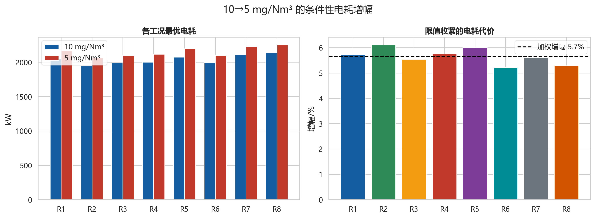

高浓度工况建议：

1. 采用入口质量负荷前馈，在高负荷进入电场前预置电压与振打周期；
2. 优先强化减排收益最高的电场，并保留末级电场的精细捕集余量；
3. 四场振打错峰，禁止相位重合导致瞬时峰值叠加；
4. 用进入/退出双阈值设置滞回，避免工况边界附近频繁切换；
5. 若要长期保证5 mg/Nm³，应先做整流变压器、电极和火花率校核，不能直接把条件仿真电压作为现场指令。

## 6. 稳健性、局限与复现

- `sensitivity_high_regime.csv` 给出关键机理系数±30%扰动下的达标概率；先验减弱30%时，部分策略会失去达标性，说明5 mg/Nm³结论必须与现场标定联用。
- `q4_high_regime_bootstrap.csv` 保存12组独立优化重采样，用于区间与算法稳定性检查。
- 附件没有二次电流、实际振打触发时刻、粉尘比电阻和粒径分布；这些缺失是排放外推不确定性的主要来源。
- 权威依据：[生态环境部水泥行业超低排放意见](https://www.mee.gov.cn/xxgk2018/xxgk/xxgk03/202401/t20240119_1064243.html)、[EPA电除尘性能模型](https://nepis.epa.gov/Exe/ZyPURL.cgi?Dockey=9101MY0A.TXT)、[EPA电除尘检查手册](https://nepis.epa.gov/Exe/ZyPURL.cgi?Dockey=9400034C.TXT)、[高温电除尘实验研究](https://doi.org/10.1016/j.seppur.2015.01.016)、[振打再飞扬研究](https://doi.org/10.1021/es00127a012)。
